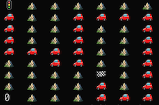

# pathfinder

**Find a path using A\* search**

Sample input:

```c++
int init[2]{0, 0};
int goal[2]{4, 5};
```

board file:

```
0,1,1,1,1,1,1,
0,1,1,0,0,0,0,
0,1,1,0,1,1,0,
0,1,1,0,1,1,0,
0,0,0,0,1,1,0,
1,1,0,0,1,1,0,
1,1,1,1,0,1,0,
1,1,1,1,0,1,0,
0,1,1,1,0,0,0,
```

Output:


